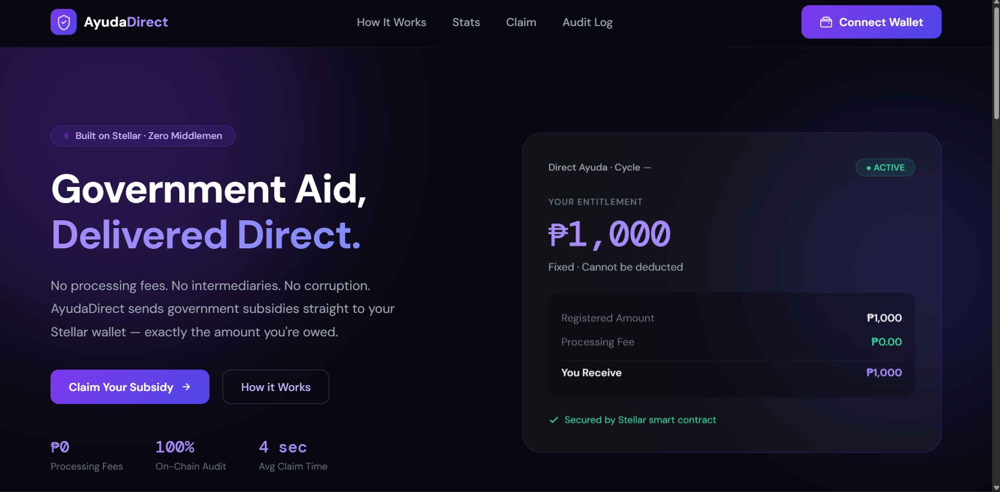
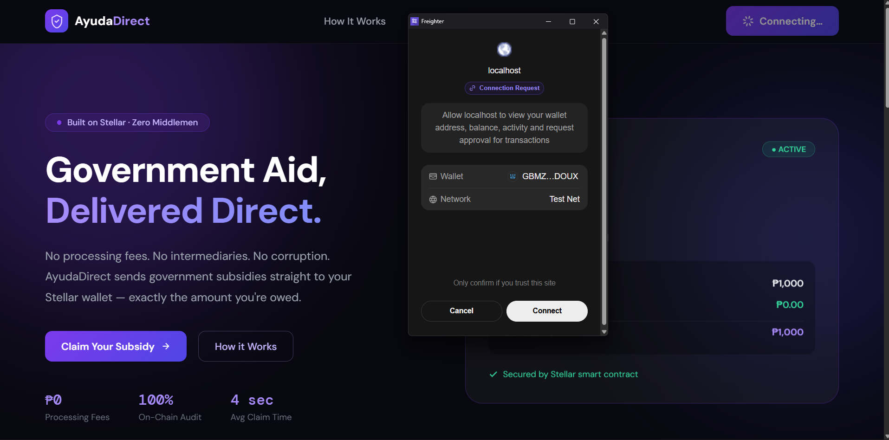
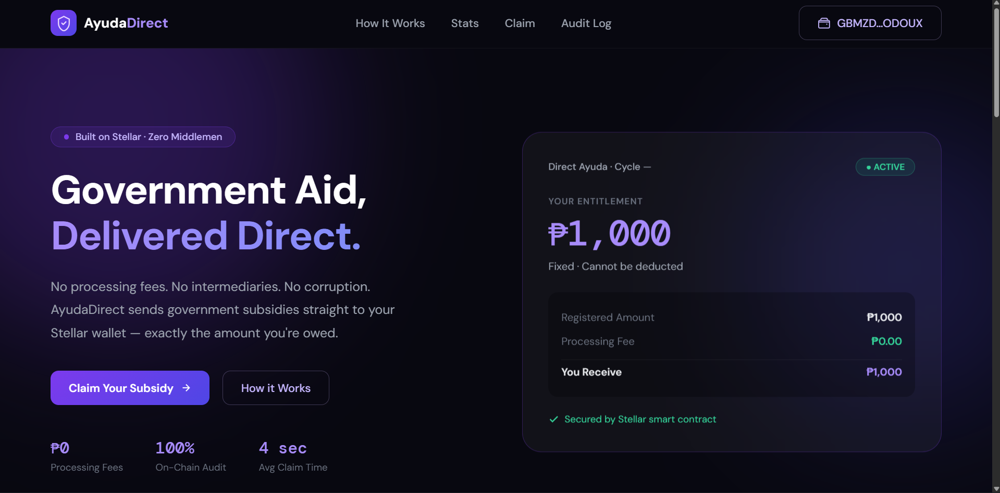
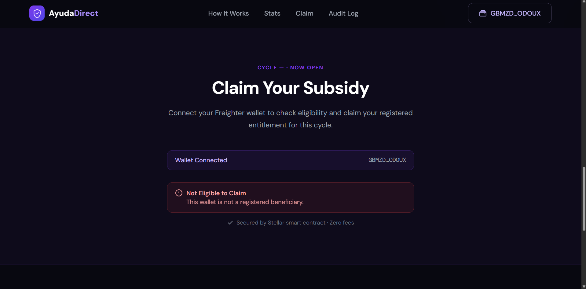
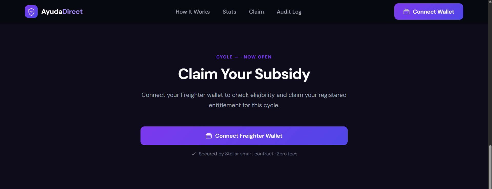
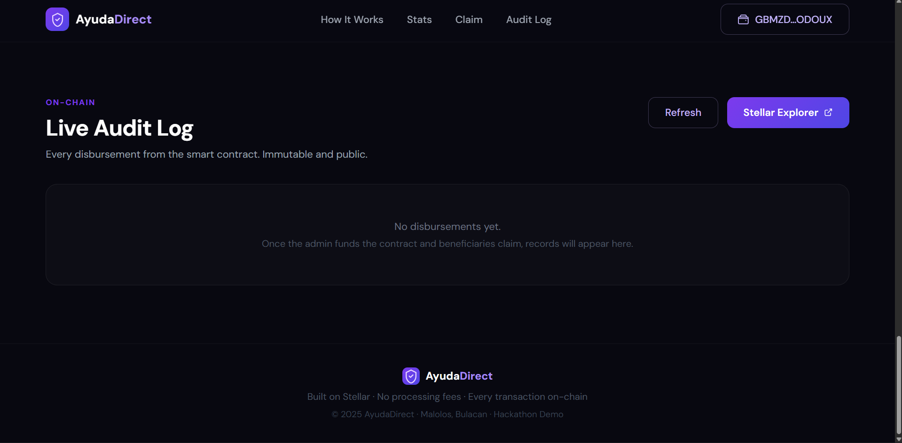

# Direct Ayuda
Government aid — delivered directly. No middlemen. No deductions.

---

## 🚀 Overview

**Direct Ayuda** is a Soroban-powered subsidy disbursement system built on Stellar that ensures government aid reaches beneficiaries **exactly as intended** — no intermediaries, no hidden fees, and fully auditable on-chain.

Instead of passing through multiple layers (LGUs, agents, processors), funds go **directly from the contract to the citizen’s wallet**.

---

## 🎯 Problem

Traditional aid distribution systems suffer from:

- ❌ Intermediaries deducting “processing fees”
- ❌ Delays and inefficiencies
- ❌ Lack of transparency and auditability
- ❌ Manual tracking prone to corruption

---

## 💡 Solution

Direct Ayuda replaces the entire pipeline with a **smart contract-based system**:

- Funds are deposited on-chain
- Beneficiaries are registered with **fixed entitlements**
- Claims are executed **directly to wallets**
- Every transaction is **publicly verifiable**

---

## 📱 App Walkthrough

### 1. Landing Page
Users are introduced to a transparent, zero-middleman subsidy system.



---

### 2. Connect Wallet
Users connect their Freighter wallet to access their subsidy.


---

### 3. Wallet Connected
The system verifies eligibility and displays the users address.



---

### 4. Claim Subsidy
Eligible users can claim instantly — no approvals, no deductions.




---

### 5. Audit Log
Every disbursement is recorded and publicly viewable.



---

## 🧠 How It Works

1. **Fund Contract**  
   Government deposits subsidy tokens into the smart contract.

2. **Register Beneficiaries**  
   Each citizen is assigned a **fixed entitlement**.

3. **Claim**  
   Users connect their wallet and claim their subsidy.

4. **Audit**  
   Every transaction is logged permanently on-chain.

---

## 🔐 Smart Contract Design

The contract enforces strict guarantees:

- Only admin can fund and register beneficiaries  
- Entitlements are **immutable once set**  
- Each beneficiary can claim **once per cycle**  
- No deductions are possible  
- All disbursements are recorded for auditing  

:contentReference[oaicite:0]{index=0}

---

## 🔗 Deployed Contract

🪪 **Contract ID**  
`CA5XHXW5TV74L4OYXIM3MHEBDGR6ZKZACKBDHQ74CQ2BGNSVUAOKIVVA`

🔗 **Transactions**
- https://stellar.expert/explorer/testnet/tx/b968ad8922fbc072ba06ff1f928e8f21d6c94bd93b5cf3dc31eeb40d189c6458
- https://lab.stellar.org/r/testnet/contract/CA5XHXW5TV74L4OYXIM3MHEBDGR6ZKZACKBDHQ74CQ2BGNSVUAOKIVVA

---

## 📊 Contract Screenshots

  


---

## ⚙️ Tech Stack

| Layer           | Technology |
|----------------|----------|
| Smart Contract | Soroban (Rust) |
| Frontend       | React + Vite |
| Wallet         | Freighter |
| Blockchain     | Stellar Testnet |
| Data Source    | Horizon Events (Audit Log) |

---

## 🔌 Core Functions

| Function | Description |
|--------|------------|
| `fund` | Deposit subsidy funds |
| `register_beneficiary` | Register citizen with entitlement |
| `claim` | Claim subsidy |
| `disburse_to` | Admin-triggered disbursement |
| `advance_cycle` | Open new claim cycle |
| `get_audit_log` | Retrieve transaction history |

---

## 🧪 Example Flow

1. LGU deposits ₱1,000,000 into the contract  
2. Juan Dela Cruz is registered with ₱1,000 entitlement  
3. Juan connects his wallet  
4. He clicks **Claim**  
5. ₱1,000 is sent instantly — no deductions  
6. Transaction is recorded permanently  

---

## 🔍 Transparency & Auditability

- Every claim emits an on-chain event  
- Audit logs are fetched via Horizon  
- Anyone can verify disbursements in real time  

:contentReference[oaicite:1]{index=1}

---

## 🚧 Future Scope

- 🔁 Multi-cycle automated disbursement
- 📱 Mobile app (React Native)
- 🔔 SMS/email notifications for beneficiaries
- 🪙 Stablecoin support (PHP-pegged tokens)
- 🏛️ Integration with LGU systems
- 📊 Public analytics dashboard

---

## 🛠️ Getting Started

### Prerequisites
- Node.js
- Rust + Stellar CLI
- Freighter Wallet

### Run Frontend
```bash
npm install
npm run dev
